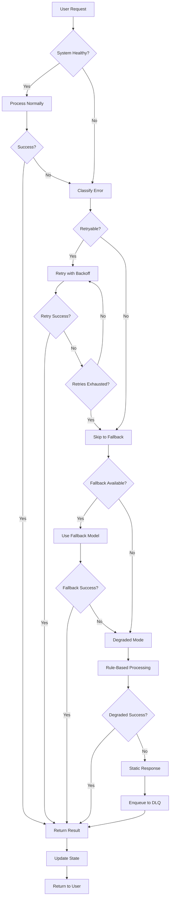
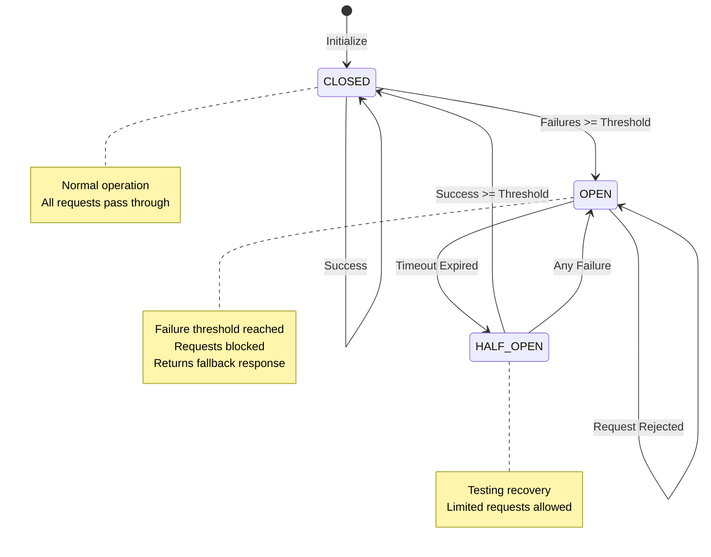
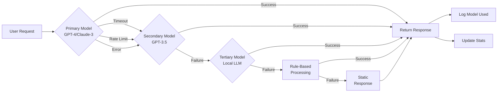
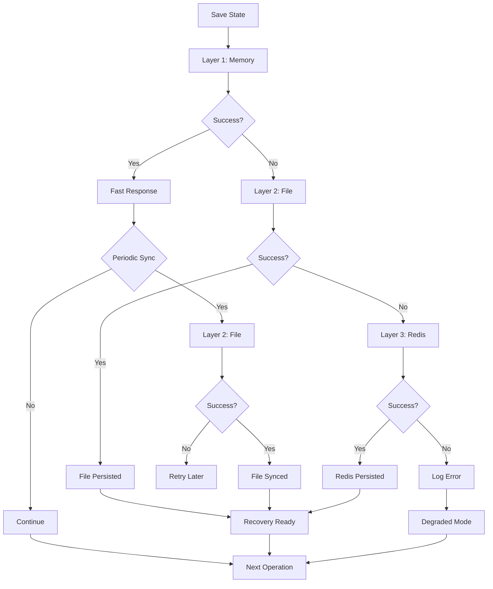
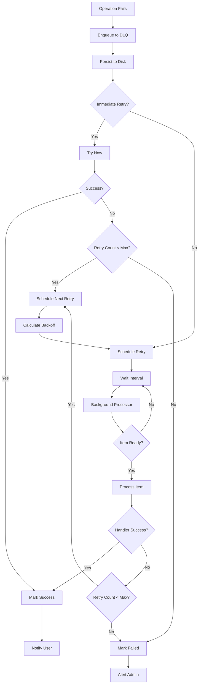
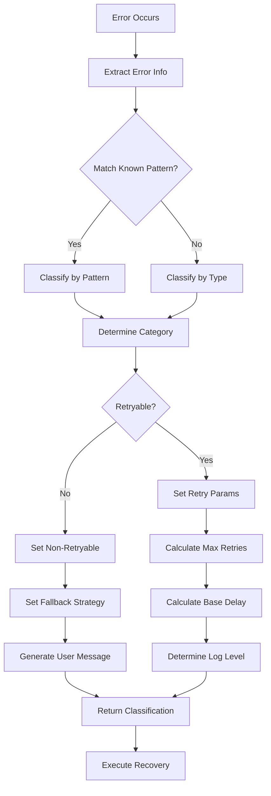
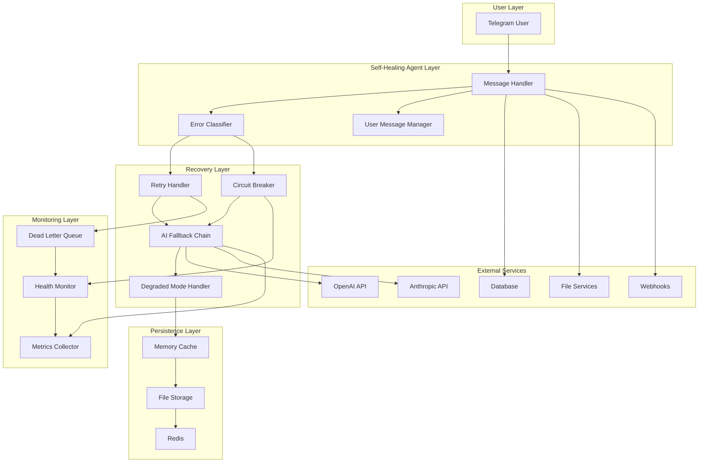
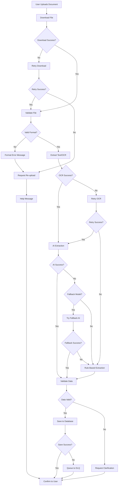

# Recovery Flow Diagrams

This document contains visual diagrams of all recovery flows in the self-healing invoice agent system.

## Table of Contents

1. [Main Recovery Flow](#main-recovery-flow)
2. [Circuit Breaker State Flow](#circuit-breaker-state-flow)
3. [AI Model Fallback Chain](#ai-model-fallback-chain)
4. [State Persistence Layers](#state-persistence-layers)
5. [Dead Letter Queue Flow](#dead-letter-queue-flow)
6. [Error Classification Flow](#error-classification-flow)
7. [System Architecture](#system-architecture)
8. [Document Processing Recovery Flow](#document-processing-recovery-flow)

---

## Main Recovery Flow

The main recovery flow shows how every user request is processed with multiple layers of protection:

**Key Points:**
- Every request goes through multiple recovery layers
- User always receives a response (never crashes)
- Failed operations are queued for later retry
- State is preserved throughout the process

---

## Circuit Breaker State Flow

The circuit breaker prevents cascade failures by temporarily blocking calls to failing services:

**States:**
- **CLOSED**: Normal operation, all requests pass through
- **OPEN**: Service is failing, requests are blocked
- **HALF_OPEN**: Testing if service has recovered

**Transitions:**
- CLOSED → OPEN: After N consecutive failures
- OPEN → HALF_OPEN: After recovery timeout
- HALF_OPEN → CLOSED: After M consecutive successes
- HALF_OPEN → OPEN: Any failure

---

## AI Model Fallback Chain

Multi-tier fallback system for AI model failures:

**Fallback Chain:**
1. **Primary**: GPT-4, Claude-3 (best quality)
2. **Secondary**: GPT-3.5 (good quality, faster)
3. **Tertiary**: Local LLM (offline capable)
4. **Rule-Based**: Pattern matching (no AI)
5. **Static**: Pre-written responses (never fails)

---

## State Persistence Layers

Multi-layer state persistence for crash recovery:

**Persistence Layers:**
1. **Memory**: Fastest, volatile (primary write)
2. **File**: Survives restarts (periodic sync)
3. **Redis**: Distributed, fast (optional)

**Strategy:**
- Write to memory immediately for speed
- Sync to file periodically (every 60s)
- Use Redis if available for distributed setups

---

## Dead Letter Queue Flow

Queue for failed operations with automatic retry:

**Features:**
- Automatic retry with exponential backoff
- Priority-based processing
- Persistent storage
- Manual inspection and replay

---

## Error Classification Flow

How errors are classified for targeted recovery:

**Classification Output:**
- Error category (AI model, database, network, etc.)
- Severity level (critical, high, medium, low)
- Retryability (yes/no)
- Retry parameters (max retries, delays)
- Fallback strategy
- User-friendly message

---

## System Architecture

Complete system architecture overview:

---

## Document Processing Recovery Flow

Specialized recovery flow for document processing:

**Recovery Points:**
1. Download retry (3 attempts)
2. OCR retry (3 attempts)
3. AI fallback chain
4. Rule-based extraction
5. DLQ for database failures

---

## Summary

The self-healing system provides:

1. **Never-Fail Guarantee**: Users always receive a response
2. **Layered Recovery**: Multiple fallback strategies
3. **Automatic Retry**: Intelligent retry with backoff
4. **Circuit Breakers**: Prevent cascade failures
5. **State Persistence**: Survive crashes and restarts
6. **Dead Letter Queue**: Handle and retry failed operations
7. **User-Friendly Messages**: No technical jargon exposed
